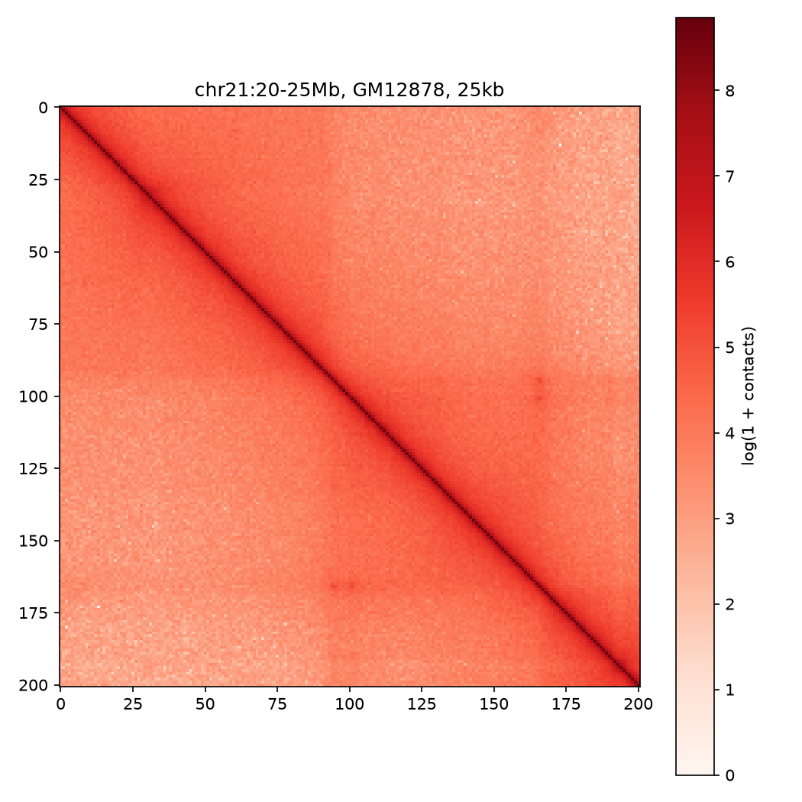
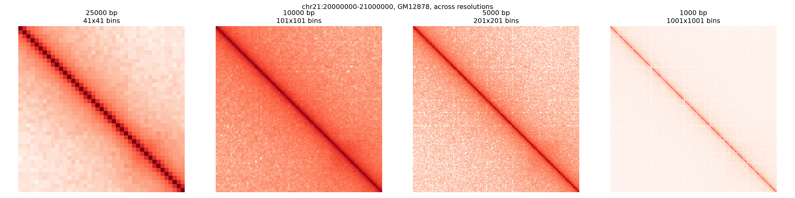
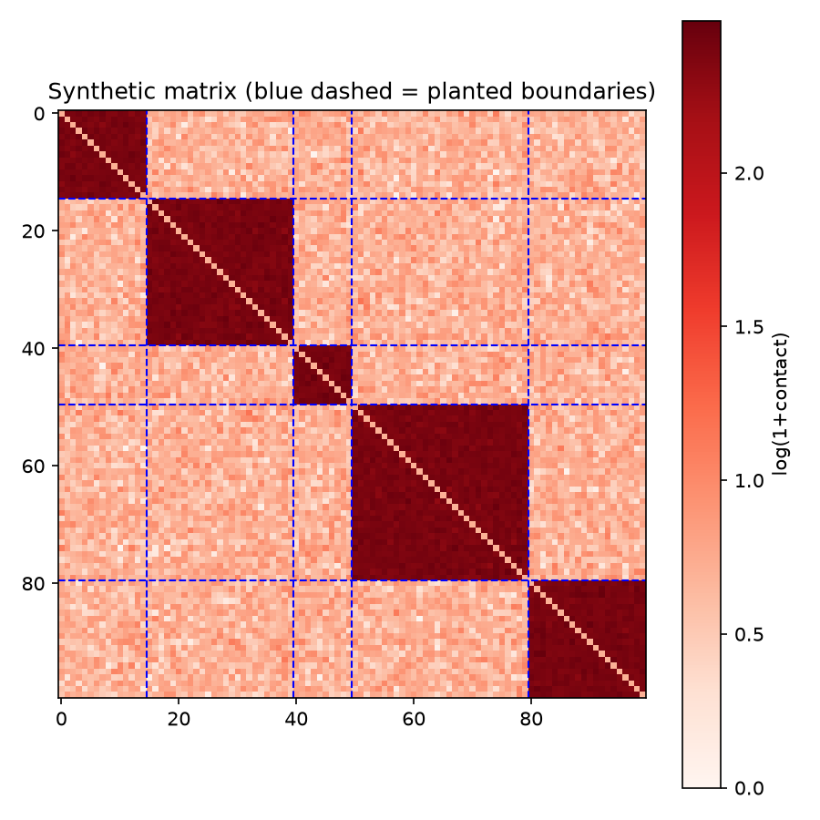
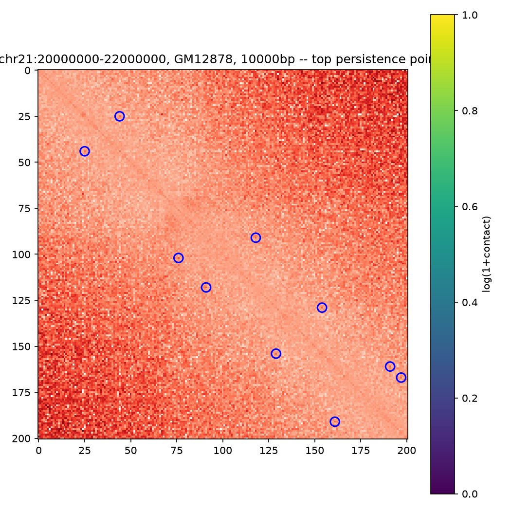
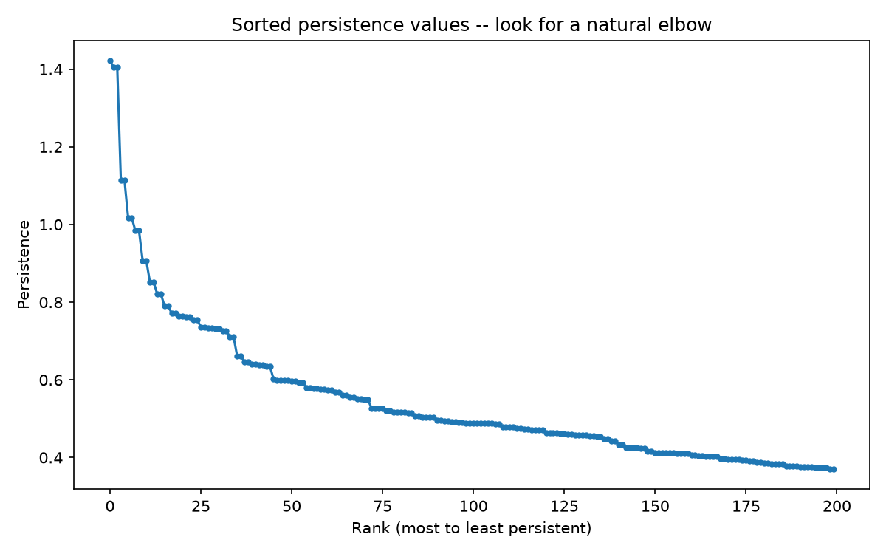

# hic-boundary-persistence

Persistence-weighted boundary hierarchy scoring for Hi-C topologically associating domains (TADs). Developed as part of the Fatima Institute AI Research Fellowship, under guidance from Dr. Muhammad Shamim.

## What this is

Standard TAD boundary calling (insulation score) gives a flat yes/no per boundary, with no formal confidence measure, and cannot represent nested or hierarchical domain structure. This project adds a persistent homology-based refinement layer on top of standard breakpoint calling:

1. Stage 1 -- standard insulation-score breakpoint detection (unchanged, using the existing method as implemented in cooltools/cooler).
2. Stage 2 -- windowed persistent homology within each candidate domain, turning boundary strength into a formal persistence value, with a depth-calibrated confidence bound derived from the persistence stability theorem.

See hic_boundary_persistence.pdf for the full methods writeup, including the falsifiable claims being tested, the mathematical derivation of the confidence bound, and the real-data findings described below.

## Project status

Early-stage / exploratory. The Stage 2 persistent homology method has been validated on synthetic data with known ground truth, and then tested directly on real Hi-C data -- which surfaced two real, necessary corrections described in detail below. Stage 1 (insulation score) and full-scale benchmarking are still in progress.

## Repository structure

- src/io_utils.py -- load .hic files via straw, pull contact matrices, plot heatmaps
- src/synthetic_validation.py -- validates Stage 2 persistent homology against known planted boundaries
- src/real_data_persistence.py -- applies the validated method to real GM12878 Hi-C data
- src/insulation.py -- Stage 1: insulation-score breakpoint calling (in progress)
- src/persistence.py -- Stage 2: windowed persistent homology (in progress)
- src/benchmark.py -- benchmark metrics: CTCF/cohesin enrichment, reproducibility (in progress)
- figures/ -- generated plots (see walkthrough below)
- requirements.txt
- hic_boundary_persistence.pdf -- full methods paper

## Setup

This project requires a Linux environment (native Linux, or WSL2 on Windows) because two core dependencies (cooltools, hic-straw) are C/C++ extensions that fail to build on Windows/MSVC.

### System prerequisites (Ubuntu/WSL2)

    sudo apt update
    sudo apt install -y python3-pip python3-venv build-essential libcurl4-openssl-dev

libcurl4-openssl-dev is required specifically for hic-straw to build (it streams .hic files over HTTP).

### Python environment

    python3 -m venv venv
    source venv/bin/activate
    pip install -r requirements.txt

## Running

Pull a real contact matrix and view it:

    python3 src/io_utils.py

Validate the persistent homology method against synthetic data with known planted boundaries:

    python3 src/synthetic_validation.py

Run the validated method against real GM12878 Hi-C data:

    python3 src/real_data_persistence.py

Output plots land in figures/.

## Walkthrough: what the figures show

### 1. First look at real data

A first pull of a real Hi-C contact matrix (chr21:20-25Mb, GM12878, 25kb resolution), just to confirm the pipeline works end to end against real data before building anything on top of it.

The same region viewed at four resolutions (25kb down to 1kb, the finest this particular file has). Structure sharpens as resolution gets finer. This file does not go below 1kb -- reaching the 500bp/200bp resolution Dr. Shamim asked about will require a different data type (ENCODE intact Hi-C, still being integrated -- see Datasets in the paper).

### 2. Validating the method on synthetic data

Before trusting the persistent homology method on real data, it was tested against a synthetic matrix with known, planted TAD boundaries (blue dashed lines). This caught a real bug: a naive cubical filtration trivially connects every planted block into one component, because consecutive diagonal pixels always touch at a corner regardless of block structure. The fix -- masking the exact diagonal -- is standard Hi-C practice anyway (self-contacts are an assay artifact, not real signal). After the fix, all 4 planted boundaries were recovered, separated from noise by close to an order of magnitude in persistence.

### 3. Applying the corrected method to real data -- two more real findings

Testing the corrected method on real GM12878 data surfaced two further issues that synthetic data could not reveal, since the synthetic model had no analogue of genomic distance decay.

**Finding 1: raw contact counts are dominated by distance decay, not domain structure.** Real Hi-C contact frequency falls off steeply with genomic distance, so near-diagonal pixels always look deepest to the filtration regardless of TAD structure. Fix: use observed/expected (O/E) values instead of raw counts.

**Finding 2: O/E ratios at long range are dominated by sampling noise.** Switching to O/E moved the problem rather than fixing it -- detected boundaries jumped to the far corners of the analysis window (the longest-range pairs within it), since expected counts shrink toward zero at long distance, so a single stray read produces a huge, spurious O/E ratio. Shrinking the window does not help, since the far corner of any window is always its own longest-range pair. Fix: restrict the persistence computation to a bounded genomic distance band (~300kb, real single-TAD scale) around the diagonal, independent of the overall window size.

The same chr21 region after both corrections. Detected high-persistence points (blue circles) now cluster near the diagonal, consistent with the visible domain-like structure in the matrix, instead of sitting on the diagonal itself or at the window corners.

All persistence values, sorted descending. Unlike the clean, sharp gap seen on synthetic data (where domains were built as strictly binary), real data shows a steep initial drop then a smooth, continuous taper rather than a hard noise floor -- consistent with real domain strength being a spectrum rather than a yes/no, which is itself relevant to the hierarchy claim this project is testing (see the paper for the full argument).

## Data

Uses public Hi-C data (Rao et al. 2014, GM12878, GEO GSE63525) via direct HTTP streaming -- no local download or data redistribution. ENCODE intact Hi-C data (K562: ENCSR479XDG, HCT116: ENCSR218URU) is being integrated for the ultra-high-resolution question.

## Compute

Genome-wide runs are intended to run on Modal (https://modal.com), a serverless compute platform, once the method is validated locally. Not yet implemented -- all work so far has run on a single local machine (WSL2).
